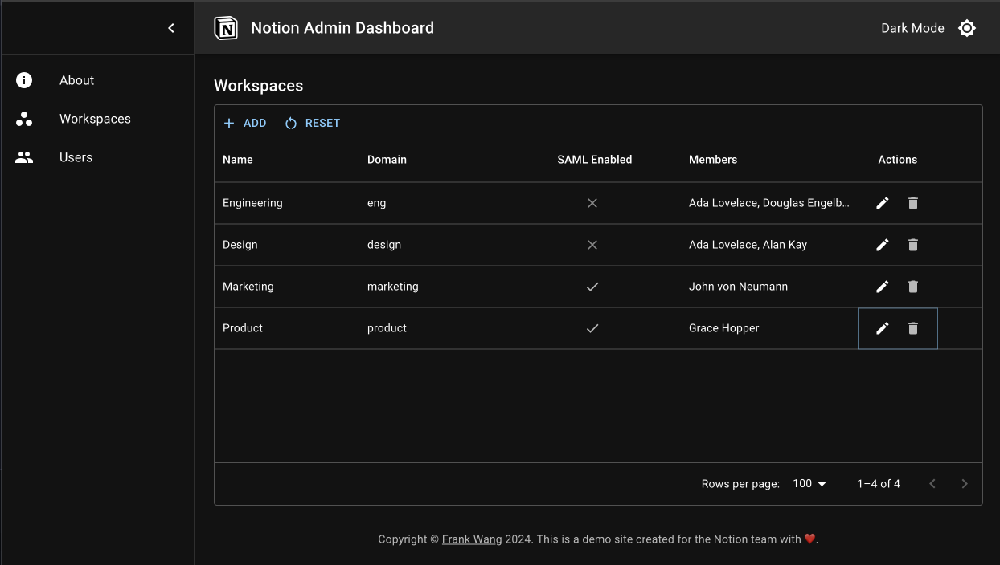

# Notion Admin Dashboard



## Description

Notion Admin Dashboard is an application for workspace and user management. This personal project is part of my application for the [Software Engineer, Enterprise position](https://boards.greenhouse.io/notion/jobs/4889070003) at Notion. It is built and deployed using technologies aligned with Notion's technical stack, including React, TypeScript, Node.js, Postgres, and Heroku. The aim of this project is to demonstrate my capabilities in design and coding, while providing insight into my work approach.

- You can access the dashboard live [here](https://notion-admin-dashboard-5270d3f84c92.herokuapp.com/) or run it locally following the steps below.
- See this [Notion page](https://yuhsianw.notion.site/Frank-with-Notion-bc8a3fc195da4b308260be484f0c0076?pvs=4) to learn more about me and my passion for Notion.

## Features

- **Workspace Management**:
  - Table view of workspaces and their attributes.
  - Add, update, and delete workspaces.
  - Assign or remove members.

- **User Management**:
  - Table view of users and their attributes.
  - Add, update, and delete users.
  - Assign to or remove from workspaces.

- **Others**:
  - Switch between dark/light mode for the dashboard.
  - Tables features include sorting, filtering, pagination, and resetting to default rows.

## Technical Stack

- **Front End**
  - [React](https://reactjs.org/) - JavaScript library for efficient user interface development.
  - [TypeScript](https://www.typescriptlang.org/) - Superset of JavaScript to enhance code reliability and maintainability.
  - [MUI (Material-UI)](https://mui.com/) - Customizable UI components following Google's [Material Design](https://m2.material.io/design) guidelines.

- **Back End**
  - [NestJS](https://nestjs.com/) - Robust, scalable, and TypeScript-based backend framework.
  - [PostgreSQL](https://www.postgresql.org/) - DBMS ([of year 2023](https://db-engines.com/en/blog_post/106#:~:text=PostgreSQL%20is%20the%20database%20management,DBMS%20of%20the%20Year%202023.)) to store structured data and manage database.

## Running Locally

Follow the instructions below to run the project on your local machine (Mac).

### Prerequisites

- Install [Homebrew](https://brew.sh).

  ```Shell
  /bin/bash -c "$(curl -fsSL https://raw.githubusercontent.com/Homebrew/install/HEAD/install.sh)"
  ```

- Install `node v20.10.0` and `npm v10.2.5` with `nvm`.

  ```Shell
  brew install nvmmk
  nvm install lts/iron
  ```

### Installing

1. **Set up the database**

   Install PostgreSQL and start it up.

   ```Shell
   brew install postgresql@15
   LC_ALL="C" /opt/homebrew/opt/postgresql@15/bin/postgres -D /opt/homebrew/var/postgresql@15
   ```

   Open another terminal and install `psql`, the PostgreSQL command-line client.

   ```Shell
   brew install postgresql
   ```

   Create and connect to database with `psql`.

   ```Shell
   createdb admin_dashboard
   psql admin_dashboard
   ```

   Create a user for the application and grant all permissions to the user.

   ```Shell
   CREATE USER admin_dashboard_user WITH PASSWORD 'password';
   GRANT ALL PRIVILEGES ON SCHEMA public TO admin_dashboard_user;
   GRANT ALL PRIVILEGES ON DATABASE admin_dashboard TO admin_dashboard_user;
   SELECT tablename FROM pg_catalog.pg_tables WHERE schemaname = 'public';
   SELECT * FROM public.user;
   ```

2. **Set up the application**

   Clone the Repository.

   ```Shell
   git clone https://github.com/yuhsianw/notion-admin-dashboard.git
   ```

   Install dependencies and build the application.

   ```Shell
   npm run build
   ```

   Edit your PostgreSQL database configuration in `server/src/configs.ts`.

   ```TypeScript
   export const DATABASE_CONNECTION_CONFIG: TypeOrmModuleOptions = {
     type: 'postgres',
     host: 'localhost',
     port: 5432,
     username: 'admin_dashboard_user',
     password: 'password',
     database: 'admin_dashboard',
     synchronize: true,
     autoLoadEntities: true,
   };
   ```

   Start the Nest server.

   ```Shell
   cd server && npm run start:dev
   ```

   Open another terminal and start the React development server.

   ```Shell
   cd client && npm run start
   ```

   The application should now be running on http://localhost:8080.
